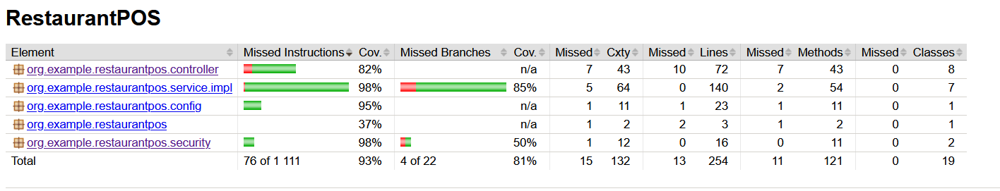

# RestaurantPOS - Java 2024/2025 Project
## Opis projektu:
Aplikacja Point of Sale (POS) dla restauracji, umożliwiająca zarządzanie zamówieniami, użtykownikami i menu. Projekt spełnia zasady SOLID i programowania obiektowego.
### Fukcje aplikacji:
- Zarządzanie użytkownikami i rolami
- Zarządzanie klientami
- Zarządzanie Menu
- Obsługa zamówień
- Płatności 
### Możliwości rozwoju:
- Raporty i analizy
- Faktury i paragony
- Moduł rezerwacji
- Integracja z systemem lojalnościowym

## Technologie
- Maven
- Spring Boot
- Spring Security
- Spring Web
- Hibernate
- PostgreSQL
- Flyway
- Docker + Docker Compose
- Swagger UI
- Junit + JaCoCO

## Uruchomienie
### Uruchamianie z Docker
`docker-compose up --build`
### Swagger UI
Po uruchieniu aplikacji:
`http://localhost:8080/swagger-ui.html`

## Zarządzanie użytkownikami i bezpieczeństwo
- Role:
  - USER
  - ADMIN
- Dostęp ograniczony przez Spring Security
- Dane logowania testowe:
  - `testadmin`
  - `testpassword'
    Role są mapowane z bazy danych przez obiekt User, który ma relację do encji Role. Zwracane są jako GrantedAuthority w klasie CustomUserDetails.
## Baza danych 
### ERD Diagram

### Migracja Flyway
Pliki migracyjne znajdują się w:
`src/main/resources/db/migration`

## REST API(Swagger UI)
Dokumentacji API dostępna jest pod:
`http://localhost:8080/swagger-ui.html`
## Testy
- Pokrycie 80%
- 

## Zastosowane wzorce projektowe i poliformizm
W projekcie zastosowano architektoniczny wzorzec **Service Layer**, który oddziela logikę biznesową od warstwy prezentacji (kontrolerów).
Dodatkowo w kodzie występuje **polimorfizm interfejsowy** – obiekty są traktowane przez ich interfejs a nie implementację, co pozwala na łatwe podstawianie różnych wariantów logiki np. w testach lub rozszerzeniach.